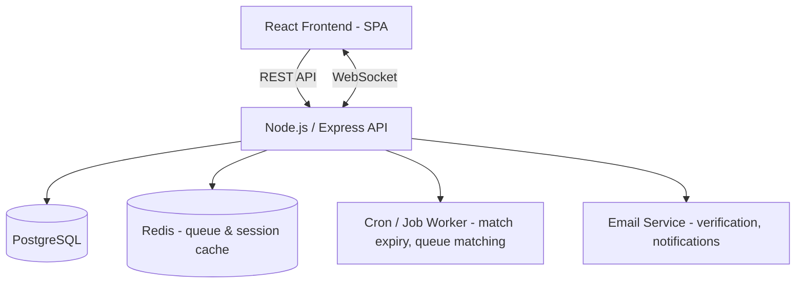
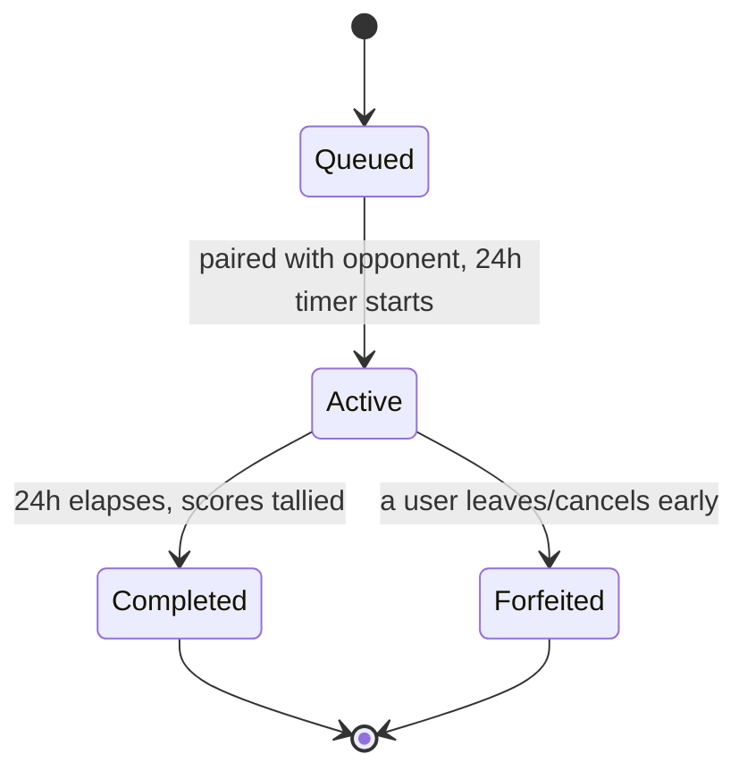

# FocusMatch — 1v1 Focused Study Match System
### Full-Stack Project Documentation
*(Working title — rename freely. This doc is written to double as a project report / SRS and a build guide.)*

---

## 1. Executive Summary

**FocusMatch** pairs two students from the same college into a private, time-boxed 1v1 study accountability match. For a 24-hour window, both students work toward self-set study goals, log their focus sessions, and see how they stack up against their opponent — who is represented only by a randomly generated anonymous username, never a real name or photo.

The core insight driving the design: competition is a strong motivator, but **public losing is a strong demotivator**. By keeping identities anonymous and results visible only to the two matched participants, FocusMatch tries to keep the upside of competition (accountability, mild stakes, fun) while removing the downside (social embarrassment, reputational risk).

This is a single-college pilot, which keeps scope, scale, and infrastructure requirements small — ideal for a student full-stack portfolio project.

---

## 2. Problem & Motivation

- Self-study is hard to sustain alone. Students procrastinate more when no one is watching and there's no deadline pressure.
- Public leaderboards and study-streak apps (e.g. habit trackers with social feeds) can backfire: seeing your real name at the bottom of a public ranking is discouraging, and some students disengage entirely rather than risk it.
- Study groups solve accountability but dilute individual effort and are hard to schedule.
- A **1v1, time-boxed, anonymous** format borrows the accountability of competition without its social cost — closer to a "silent gym buddy" than a leaderboard.

---

## 3. Core Concept

1. A student opts into matchmaking ("Find a Focus Partner").
2. The system pairs them with another opted-in student from the same college.
3. Both are assigned a random anonymous username + avatar for the duration of the match (e.g. `QuietFalcon482`).
4. A 24-hour timer starts. Each student sets tasks/goals and logs focus sessions (Pomodoro-style) during that window.
5. At the end of 24 hours, a private scorecard is revealed to **only the two matched users** — never posted publicly, never tied to real identity outside the pair.
6. Users build a personal streak/history; a global leaderboard (if any) shows anonymous usernames and aggregate stats only, never real names attached to losses.

---

## 4. Scope & Target Users

- **Audience:** Verified students of one specific college (pilot).
- **Verification:** College email domain check (e.g. `@college.edu`) at signup — this is the only place real identity touches the system.
- **Out of scope for v1:** cross-college matching, group/team matches, video/audio proctoring, grading integration.
- **Scale assumption:** hundreds to low thousands of concurrent users — this shapes the tech stack recommendation in Section 9 (no need for heavy distributed infrastructure).

---

## 5. User Personas & Stories

**Persona: "Procrastinating Priya"** — motivated but easily distracted, wants light social pressure without public embarrassment.
**Persona: "Consistent Karan"** — already disciplined, wants a way to make solo study slightly more engaging and track streaks.

Representative user stories:
- *As a student*, I want to opt into a match only when I'm actually free to study, so I'm not matched at a bad time.
- *As a student*, I want to set my own tasks/goals for the window, so the match reflects my actual coursework, not an arbitrary metric.
- *As a student*, I want my opponent to never learn my real name, so a loss doesn't feel socially risky.
- *As a student*, I want to see a clear scorecard at the end, so the match feels meaningful.
- *As a student*, I want to opt out or leave a match early without penalty spam, so I'm not trapped if something comes up.

---

## 6. Feature Set

### MVP (v1)
- College-email signup/verification
- Anonymous username + avatar generation (per account or per match — see Section 14)
- "Ready to match" toggle + matchmaking queue
- 24-hour match session with countdown timer
- Self-set task list per match (add/check off tasks)
- Built-in Pomodoro-style focus timer, logged per session
- End-of-match private scorecard (win/loss/tie + breakdown)
- Match history for the logged-in user (their own stats only)
- Basic streak counter (consecutive matches completed)

### Phase 2
- Anonymous in-match chat (light, moderated, report/block button)
- Subject/course-tag matching (match with someone studying similar material)
- Push/email notifications (match found, 1 hour left, results ready)
- Optional mutual "reveal" — both users can agree to unmask after the match ends
- Weekly recap emails

### Future / Stretch
- Small group matches (2v2 "study squads")
- Badges/achievements
- Cross-college expansion
- Campus LMS/calendar integration (auto-import deadlines as tasks)

---

## 7. User Flow

```
Sign up (college email) → Verify → Create anonymous profile
        ↓
Dashboard: streak, past results, "Find a Focus Partner" button
        ↓
Join matchmaking queue → Paired with opponent (anon username shown)
        ↓
Match starts: 24h timer begins, both set tasks
        ↓
During window: log Pomodoro sessions, check off tasks, optional check-ins
        ↓
Timer expires → Scores tallied → Private scorecard shown to both users
        ↓
Back to Dashboard: streak updated, history logged, can queue again
```

---

## 8. System Architecture



- **Frontend (SPA):** handles auth, dashboard, live countdown, task/session logging UI.
- **Backend API:** stateless REST endpoints + a WebSocket channel for live match state (opponent activity, timer sync, optional chat).
- **Redis:** holds the matchmaking queue and short-lived session/presence data — keeps matching fast without hammering Postgres.
- **Scheduler/worker:** a background job that (a) periodically pairs students waiting in the queue, and (b) closes out matches once 24 hours elapse and computes final scores.
- **Postgres:** system of record for users, matches, tasks, sessions, and results.

---

## 9. Tech Stack & Rationale

| Layer | Recommendation | Why |
|---|---|---|
| Frontend | React + TypeScript + Tailwind CSS | Fast to build, strong ecosystem, looks good in a portfolio |
| Data fetching | React Query (TanStack Query) | Handles caching/polling for match state cleanly |
| Backend | Node.js + Express (or NestJS if you want more structure) | Same language as frontend, huge ecosystem, easy to deploy free-tier |
| Real-time | Socket.io | Simplest way to sync countdown/opponent activity/chat |
| Database | PostgreSQL + Prisma ORM | Data here is inherently relational (users↔matches↔tasks); Prisma keeps schema + migrations clean |
| Queue/Cache | Redis (or BullMQ on top of Redis) | Cheap, fast matchmaking queue and job scheduling |
| Auth | JWT + email OTP restricted to college domain | No third-party identity leakage; simple to reason about |
| Background jobs | node-cron or BullMQ | Handles 24h match expiry and periodic queue-pairing |
| Hosting (student-budget friendly) | Frontend: Vercel · Backend: Render/Railway · DB: Supabase/Neon (Postgres) · Redis: Upstash | All have generous free tiers, good for a pilot at one college |

This is a strong, defensible "why these choices" stack for interviews — everything maps directly to a real requirement (real-time sync → Socket.io, relational data → Postgres, small scale → free-tier hosting) rather than being picked arbitrarily.

---

## 10. Database Schema

**users**
| Column | Type | Notes |
|---|---|---|
| id | UUID (PK) | |
| college_email_hash | text, unique | store a hash, not the raw email, wherever possible |
| is_verified | boolean | |
| created_at | timestamp | |
| current_streak | int | consecutive completed matches |
| total_matches | int | |
| total_wins | int | |
| total_losses | int | |

**anon_profiles**
| Column | Type | Notes |
|---|---|---|
| id | UUID (PK) | |
| user_id | UUID (FK → users) | |
| anon_username | text | randomly generated, e.g. "QuietFalcon482" |
| avatar_seed | text | used to deterministically generate an avatar |
| rotates_per_match | boolean | design choice — see Section 14 |

**matches**
| Column | Type | Notes |
|---|---|---|
| id | UUID (PK) | |
| user1_id | UUID (FK) | |
| user2_id | UUID (FK) | |
| status | enum | `queued`, `active`, `completed`, `forfeited` |
| start_time | timestamp | |
| end_time | timestamp | start_time + 24h |
| winner_id | UUID, nullable | set on completion |

**match_tasks**
| Column | Type | Notes |
|---|---|---|
| id | UUID (PK) | |
| match_id | UUID (FK) | |
| user_id | UUID (FK) | |
| description | text | |
| is_completed | boolean | |

**focus_sessions**
| Column | Type | Notes |
|---|---|---|
| id | UUID (PK) | |
| match_id | UUID (FK) | |
| user_id | UUID (FK) | |
| started_at | timestamp | |
| duration_minutes | int | |
| completed | boolean | did they finish without cancelling |

**match_results**
| Column | Type | Notes |
|---|---|---|
| id | UUID (PK) | |
| match_id | UUID (FK) | |
| user_id | UUID (FK) | |
| total_focus_minutes | int | |
| tasks_completed | int | |
| sessions_completed | int | |
| final_score | numeric | weighted score, see Section 13 |

---

## 11. API Design (representative endpoints)

| Method | Endpoint | Purpose |
|---|---|---|
| POST | `/auth/register` | College email verification (OTP) |
| POST | `/auth/login` | Login, returns JWT |
| GET | `/users/me` | Current user's profile + stats |
| POST | `/matchmaking/queue` | Join the matchmaking queue |
| DELETE | `/matchmaking/queue` | Leave the queue |
| GET | `/matches/current` | Get active match (if any) |
| POST | `/matches/:id/tasks` | Add a task to the current match |
| PATCH | `/matches/:id/tasks/:taskId` | Mark task complete |
| POST | `/matches/:id/sessions/start` | Start a focus session |
| PATCH | `/matches/:id/sessions/:sessionId/complete` | Complete a focus session |
| GET | `/matches/:id/result` | Get the final scorecard (only accessible by the two matched users) |
| GET | `/matches/history` | Past matches for the logged-in user |
| WS | `/ws/match/:id` | Live channel: opponent activity ticks, countdown sync, optional chat |

---

## 12. Matching Algorithm

**v1 (simple, ships fast):**
- Students who tap "Find a Focus Partner" enter a Redis queue with a timestamp.
- A worker runs every ~30 seconds: pops the two longest-waiting students and creates a match, provided they weren't matched with each other in the last N days (cooldown, to avoid repeat pairings feeling stale).
- If the queue has an odd number waiting, the newest entrant waits for the next cycle.

**v2 (nicer matching, still simple):**
- Weight pairing by optional self-tagged subject/course so opponents are studying broadly similar material (not required, just a light preference).
- Loose skill/streak banding (e.g. don't always pair a 40-match streak veteran with a first-timer) so matches feel fair — this is a soft signal, not a public rating.

---

## 13. Scoring & "Win" Determination

Since this isn't a knowledge contest, focus itself needs to be measured through honest, self-reported signals rather than surveillance (no webcam/keylogging — that would undermine trust and privacy). A simple weighted score works well:

```
final_score = (0.5 × total_focus_minutes)
            + (30 × tasks_completed)
            + (10 × sessions_completed)
```

(Weights are tunable — the point is that all three matter: time spent, goals actually finished, and consistency of showing up for sessions.)

- Higher `final_score` at the 24-hour mark wins the match.
- Ties are allowed and shown as a draw — not every match needs a loser.
- This is intentionally **self-reported and honor-system based** for v1. That's a reasonable trade-off for a pilot: the goal is gentle accountability, not proctored surveillance, and over-instrumenting would work against the trust the anonymity design is trying to build.

---

## 14. Privacy & Anonymity Design

This is the feature that makes the product idea distinctive, so it deserves explicit rules:

- **Identity boundary:** the college email is used only for one-time verification. Store a hash, not the plaintext email, wherever it doesn't need to be reversible. No API response ever includes another user's email or real name.
- **Anonymous identity:** each account gets a randomly generated username + avatar. Decide early whether this is:
  - *Persistent per account* (same anon identity across all matches — lets a "reputation" build up anonymously), or
  - *Rotating per match* (a fresh random identity each time — maximum privacy, but no persistent anonymous reputation).
  Persistent-per-account is usually the better default: it lets streaks/history feel meaningful while still never touching real identity.
- **No public loss board:** there is no global feed showing "who lost to whom." Any leaderboard is opt-in, aggregate, and anonymous-username-only.
- **Scorecard access control:** `/matches/:id/result` must verify the requester is one of the two matched user IDs — enforce this at the API layer, not just the UI.
- **Optional mutual reveal (Phase 2):** if both users tap "reveal" after a match, real usernames/first names can be shown to each other only, never to anyone else. This is opt-in and reversible in intent (both must agree).
- **Chat (if added):** anonymous-to-anonymous only, with report/block, and no way to share contact info that would break the anonymity boundary until a mutual reveal has happened.

---

## 15. Match Lifecycle (24-Hour State Machine)



- **Queued:** waiting for an opponent.
- **Active:** timer running, both users can log tasks/sessions.
- **Completed:** background job closes the match at `end_time`, computes `match_results` for both users, updates streaks/history.
- **Forfeited:** if a user explicitly leaves, the match ends early without counting as a loss for the remaining user (avoid punishing someone for their opponent's exit) — this is a design choice worth calling out in your report.

---

## 16. Non-Functional Requirements

- **Scale:** single-college pilot — low thousands of users at most. No need for microservices or multi-region infra; a single well-indexed Postgres instance and one backend service is plenty.
- **Security:** hash emails, rate-limit auth endpoints, validate that scorecard/match endpoints check ownership, sanitize any chat input if Phase 2 chat ships.
- **Reliability:** the 24h-expiry job must be idempotent (safe to re-run) in case the worker restarts mid-cycle.
- **Performance:** matchmaking cycle and WebSocket updates should feel near-instant (sub-second) even though the overall match runs for 24 hours — it's the *live* touches (opponent joined, task ticked) that need to feel snappy.
- **Data retention:** define how long match history is kept, and make sure account deletion cascades and actually removes hashed identity links.

---

## 17. Screens / UI Wireframe List

1. **Landing / Login** — college email entry, OTP verification
2. **Dashboard** — streak, past win/loss summary, "Find a Focus Partner" button
3. **Matched screen** — opponent's anon username + avatar, countdown to 24h end
4. **Match workspace** — task list (add/check off), Pomodoro timer, session log
5. **Live status strip** — light indicator of opponent activity (e.g. "opponent just completed a session") without exposing details that could feel like surveillance
6. **Result / Scorecard** — private, side-by-side score breakdown, win/loss/tie
7. **History** — list of past matches (own stats), streak graph
8. **Settings** — availability toggle, notification preferences, account deletion

---

## 18. Development Roadmap (Suggested Sprints)

| Sprint | Focus |
|---|---|
| 1 | Auth (college email + OTP), base DB schema, project scaffolding |
| 2 | Matchmaking queue + anon profile generation |
| 3 | Match workspace: tasks + Pomodoro session logging |
| 4 | 24h expiry worker + scoring + private scorecard |
| 5 | Real-time layer (Socket.io): live opponent status, countdown sync |
| 6 | UI polish, notifications, history/streak views |
| 7 | Testing (unit + a few end-to-end flows), deploy to free-tier hosting |
| 8 | Small pilot with real students, gather feedback, fix issues |

---

## 19. Risks & Mitigations

| Risk | Mitigation |
|---|---|
| Users game the self-reported score | Keep stakes low/social rather than high-stakes; consider light anomaly checks later (e.g. flag absurd session counts) without full surveillance |
| Empty queue at off-peak hours (no one to match with) | Show estimated wait time; allow "notify me when matched" instead of forcing users to sit and wait |
| A user forfeits and their opponent feels cheated | Forfeits don't count as a loss for the remaining user; remaining user can immediately re-queue |
| Anonymity broken by users chatting real details (Phase 2) | Light moderation + report/block; no unsolicited contact-info sharing before mutual reveal |
| College email verification blocked by spam filters | Use a reputable transactional email provider (e.g. Postmark, SES) and clear resend flow |

---

## 20. Success Metrics

- % of started matches completed in full (not forfeited)
- Average total focus minutes logged per match
- Weekly active students relative to pilot college's population
- Streak retention (users who queue again within a week)
- Qualitative: short post-match feedback prompt ("did this help you focus?")

---

## 21. Future Enhancements

- Small-group "study squads" (2v2 or 3v3) instead of strict 1v1
- Subject/course-tagged matching
- Campus LMS/calendar integration to auto-populate tasks
- Cross-college expansion once the single-college pilot validates the concept
- Badges/achievements tied to consistency, not just wins

---

*This document is meant to be a living spec — adjust weights, schema, and stack choices as you build. Happy to expand any single section (e.g. turn Section 11 into full OpenAPI spec, or Section 10 into actual Prisma schema code) if useful.*
